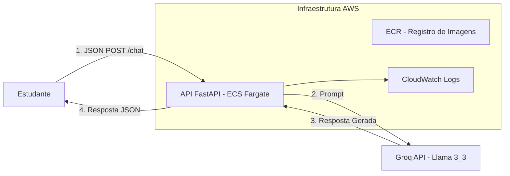
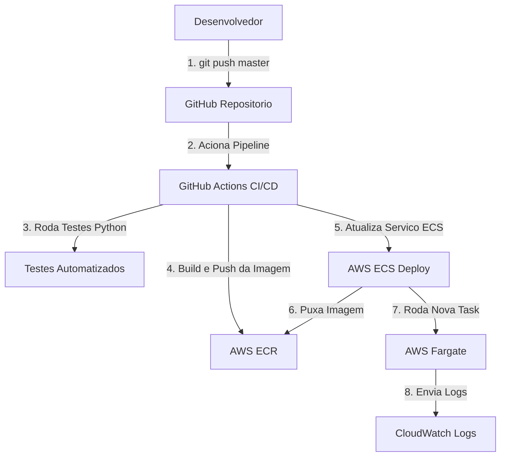

***

# IsCoolGPT: Assistente de Estudos em Cloud

**Autor:** Diego Arruda  
**Projeto:** Projeto Final Cloud 25.2

---

## 1. Visão Geral

O **IsCoolGPT** é um assistente educacional inteligente focado em Cloud Computing, DevOps e desenvolvimento de software.  
A solução foi implementada como uma API RESTful de alta performance, utilizando **Python com FastAPI** em uma arquitetura serverless moderna na AWS, com pipeline de CI/CD totalmente automatizado.

- A API se conecta à plataforma **Groq** (utilizando o modelo **Llama 3.3**) para gerar respostas em tempo real com baixíssima latência, garantindo uma experiência fluida para os estudantes.

---

## 2. Diagrama de Arquitetura do Sistema

### Fluxo do Usuário (Aplicação)



## Fluxo de DevOps (CI/CD)




## 3. Stack de Tecnologias e Decisões
| Componente         | Tecnologia Escolhida      | Justificativa                                                                                                       |
| ------------------ | ------------------------- | ------------------------------------------------------------------------------------------------------------------- |
| Backend (API)      | Python 3.10 + FastAPI          | Framework moderno, assíncrono e de alta performance, ideal para microsserviços de IA                                     |
| LLM (IA)           | Groq API – Llama 3.3      | Utilização de inferência ultra-rápida com modelos Open Source de ponta (Llama 3), sem custo de licença.                      |
| Containerização    | Docker                    | Portabilidade e consistência do ambiente da aplicação via Dockerfile otimizado (Multi-stage).                                                              |                                                                  |
| CI/CD              | GitHub Actions            | Pipeline automatizado que executa testes (Pytest) e deploy contínuo na AWS a cada push na main.                                   |
| Registro de Imagem | AWS ECR                   | Armazenamento seguro e privado das imagens Docker, integrado nativamente ao ECS.                                                                   |
| Orquestração       | AWS ECS + Fargate         | Gerenciamento de containers serverless, eliminando a necessidade de administrar instâncias EC2.                                                             |
| Segurança          | IAM & Security Groups    | Controle de acesso rigoroso (Least Privilege) e restrição de tráfego de rede (Apenas porta 8000). |                                       |
| Documentação       | Swagger UI (OpenAPI)    | Documentação automática e interativa disponível nativamente no FastAPI (`/docs`).                                                            |
| Testes       | Pytest | Suite de testes automatizados para garantir a integridade dos endpoints antes do deploy.                                                      |


## 4. Como Executar Localmente (Docker)

Pré-requisitos:

* Ter o Docker instalado.
* Possuir uma chave de API da Groq.

### 4.1 Construir a Imagem Docker
No diretório raiz do projeto:
```
docker build -t iscoolgpt:local .
```
### 4.2 Executar o Contêiner
``` docker run -p 8000:8000 \
    -e GROQ_API_KEY="SUA_CHAVE_AQUI" \
    iscoolgpt:local
```

## 5. Como Usar a API (Endpoints)
Endpoint principal

* POST /chat

Aceita um JSON com a pergunta do usuário e retorna a resposta gerada pela LLM Llama 3.3 via Groq.

Exemplo de chamada (cURL):

``` curl -X POST http://localhost:8000/chat \
     -H "Content-Type: application/json" \
     -d '{"message": "Explique o que é AWS Fargate"}'
```

**Endpoints Adicionais**

* **Health Check:** ``GET /health``

Verifica se a API está online (usado pelo Load Balancer/ECS).

* **Documentação Interativa (Swagger):** Acesse no navegador: ``http://localhost:8000/docs``

***